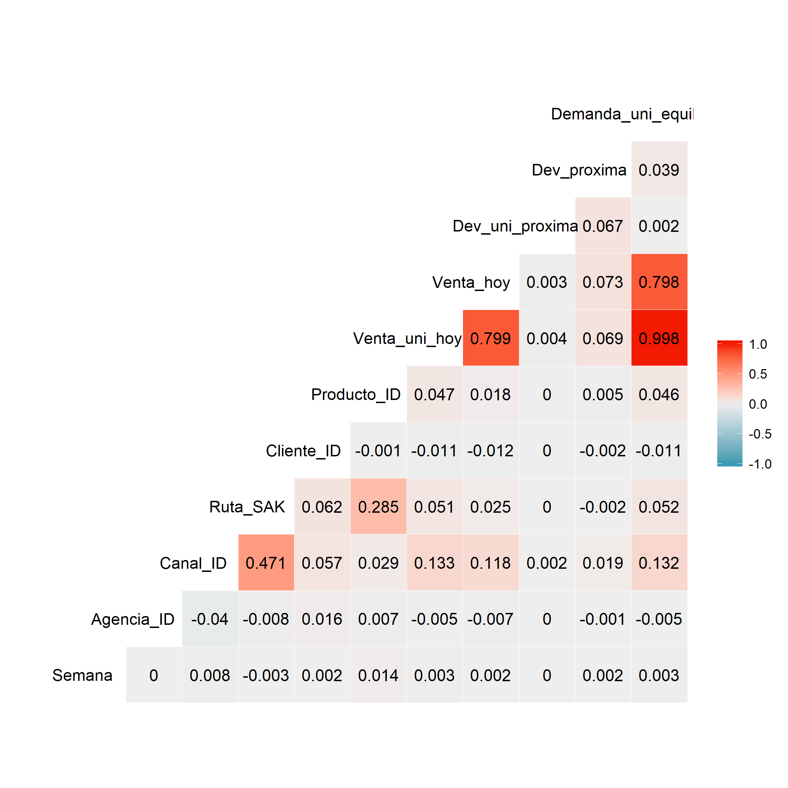
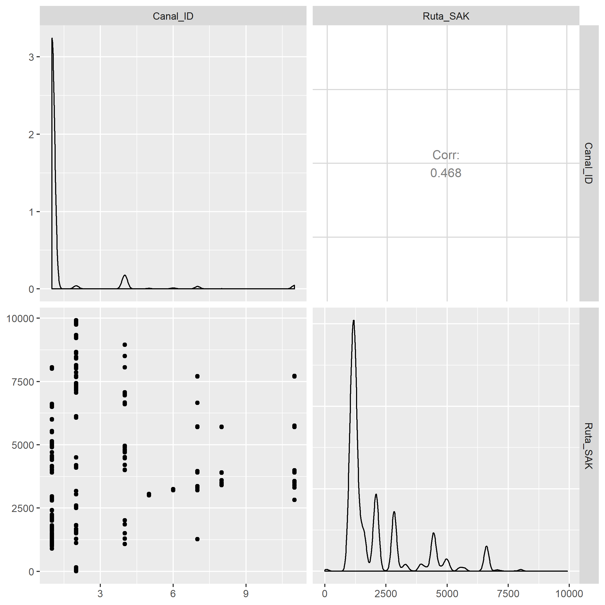
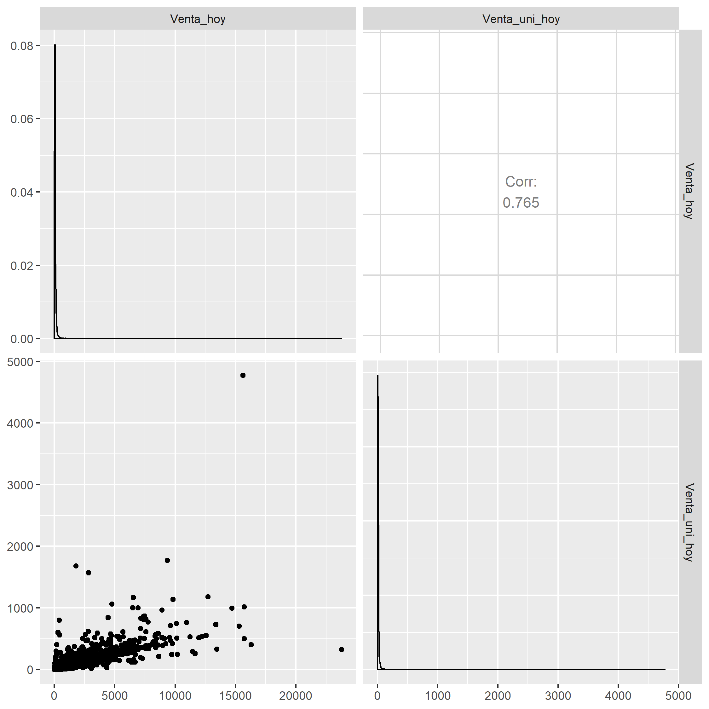
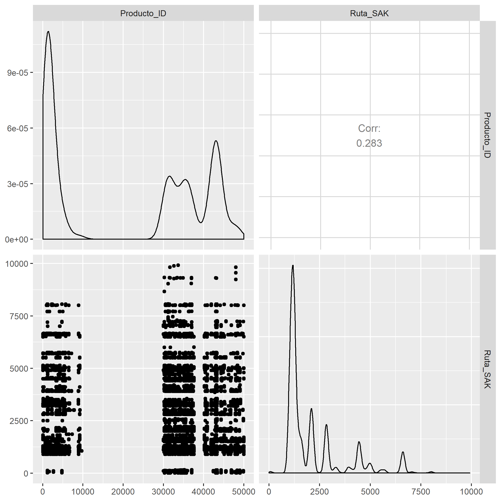
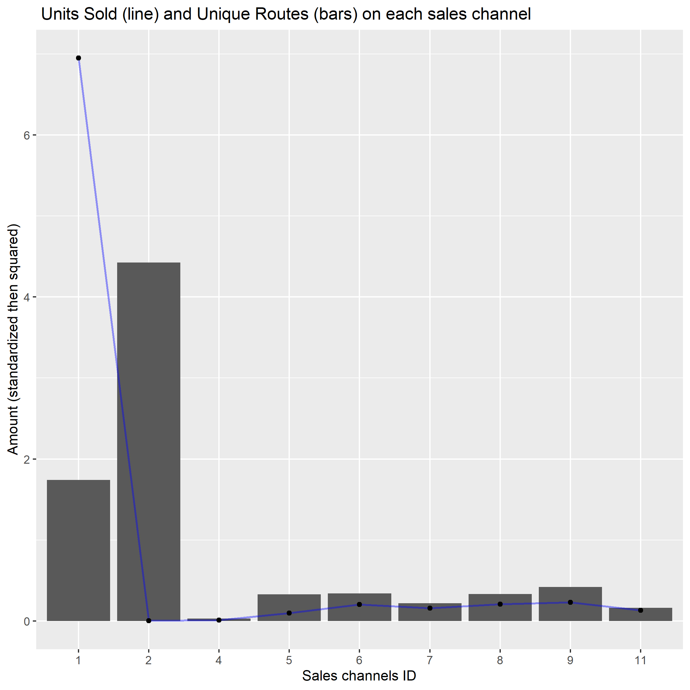
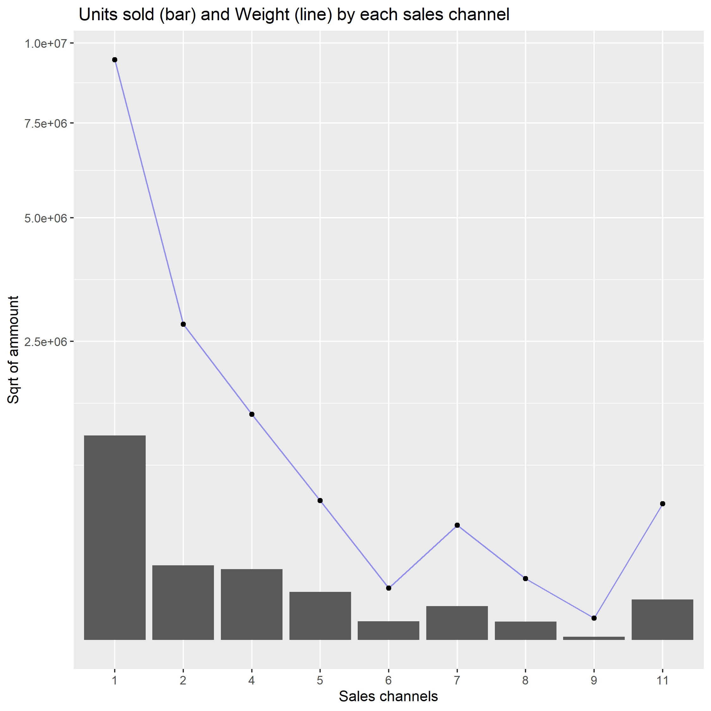
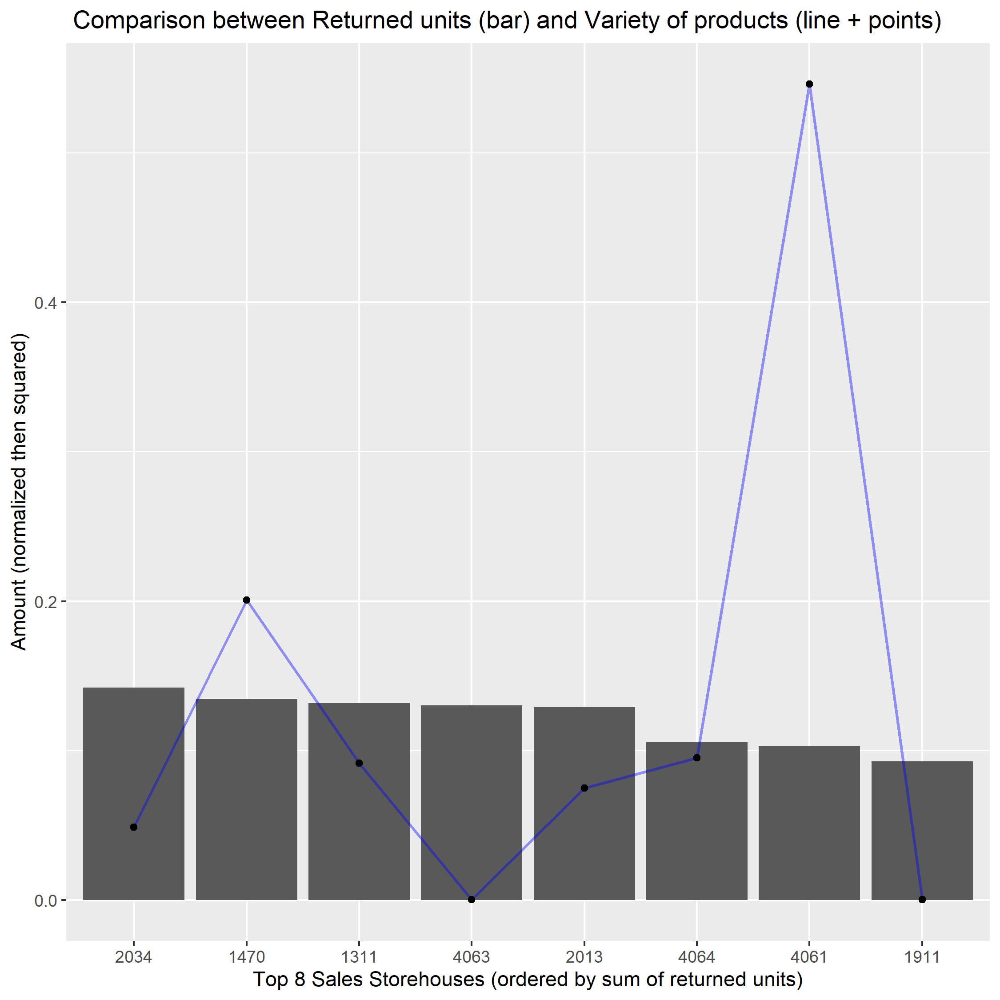
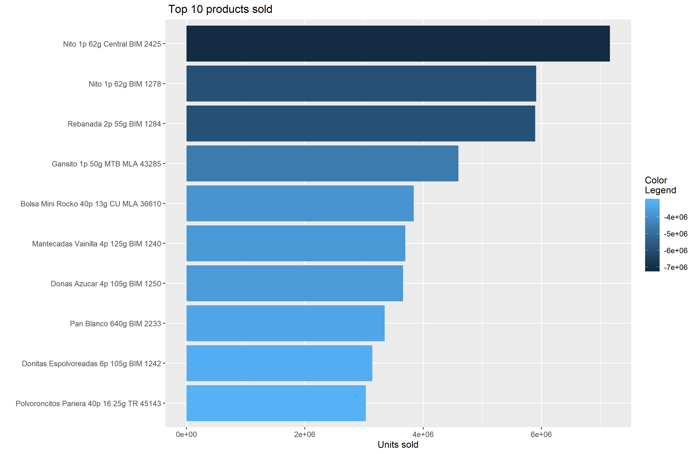

# Inventory demand prediction v1.0
Data Science Academy project on demand prediction, as part of the Data Science course.

### Summary

1. [About](#About)
2. [Personal framework for a systematic approach](#Personal-framework-for-a-systematic-approach)
3. [Plots of the analysis](#Plots-of-the-analysis)

## About

I should forecast the demand of a product for a given week, at a particular store. The dataset you are given consists of 9 weeks of sales transactions in Mexico. Every week, there are delivery trucks that deliver products to the vendors. Each transaction consists of sales and returns. Returns are the products that are unsold and expired. The demand for a product in a certain week is defined as the sales this week subtracted by the return next week.

     - What am I trying to solve?
         I should accurately forecast inventory demand based on historical sales data.
         I also should make sure consumers of over 100 bakery products aren’t staring at empty shelves, while
         also reducing the amount spent on refunds to store owners with surplus product unfit for sale.

     - Who will benefit of or is asking for this solution?
         Grupo Bimbo itself.
         Resellers of fresh bakery products from Grupo Bimbo.
         All final consumers of Grupo Bimbo products.

     - What would be the ideal scenario for them?
         Currently, daily inventory calculations are performed by direct delivery sales employees who must
         single-handedly predict the forces of supply, demand, and hunger based on their personal experiences
         with each store. With some breads carrying a one week shelf life, the acceptable margin for error
         is small.

         The ideal scenario to Grupo Bimbo would be:
           To know beforehand and accurately what would be the demand for its products.
           Doing so, be able to produce the necessary amount to support the demand, reducing waste,
           warehousing costs, maximizing production efficiency, optimizing routes, and so on.
           See more at:
           https://widgetbrain.com/demand-forecasting-retail/
           https://www.mckinsey.com/business-functions/operations/our-insights/supply-chain-analytics-harness-uncertainty-with-smarter-bets

         The ideal scenario to resellers would be:
           To have its demands supported on time; to have fresh products to offer

         The ideal scenario to final consumers would be:
           To always have fresh and diversified bakery products on shelves.

     - How could I use the available data to help them achieve this scenario?
         By doing a descriptive, diagnostic, predictive and prescriptive analysis.

     - Why solve this problem? (purpose)
         To help develop and strengthen a data-driven business culture.

## Personal framework for a systematic approach

### FUNDAMENTALS

1. Problem statement and comprehension of the context
    - What am I trying to solve?
    - Who will benefit of/is asking for this solution?
    - What would be the ideal scenario for them?
    - How could I use the available data to help them achieve this scenario?
    - Why solve this problem? (purpose)

2. Looking for data:
    - Identify entities (and its attributes) of the problem
    - Collect data that represents entities
    - Which hypotheses could I suppose?
    - Explore the data (superficially) to understand it
    - Could I use an algorithm to address the issue or solve it? Which one?

### DATA WRANGLING

3. Data preparation and Exploration (Feature Engineering orientated to the 4th and 5th phase)
    - Is my dataset tidy?
    - Is my dataset clean?
    - Which correlations exists between all variables and to the target?
    - There is any NA in my dataset? If so, how should I treat them? Which effects would it have?
    - Should I narrowing in on observations of interest? Which effects would it have?
    - Should I reduce my variables? Which effects would it have?
    - Should I create new variables that are functions of existing ones? Which effects would it have?
    - Should I binning variables? Which effects would it have?
    - should I convert variables (categorical = numerical / vv)? Which effects would it have?
    - Should I dummy coding categorical variables? Which effects would it have?
    - Should I standardize numerical variables? Which effects would it have?
    - Can I test my hypotheses?

4. Building and validating models (orientated to the 5th phase)
    - Train and test a ML model
    - Which performance metrics should I rely on?
    - Iteration

### DEPLOYING

5. Deploy
    - Data StoryTelling
    - How can I deploy the model to production?
    - Which strategies should I consider?
    - [An overview of what should be considered](https://christophergs.github.io/machine%20learning/2019/03/17/how-to-deploy-machine-learning-models/)

## Plots of the analysis

### 1. ggcorr plot - a correlation matrix with ggplot2

### 2. ggpairs - Canal ID x Ruta SAK

### 3. ggpairs - Venta uni hoy x Venta hoy

### 4. ggpairs - Ruta SAK x Producto ID

### 5. Units sold (line) and Unique routes (bars) on each sales channel

### 6. Units sold (bar) and Whight (line) by each sales channel

### 7. Units sold (bar) and Whight (line) by each sales channel

### 8. Comparison between Returned units (bar) and Variety of products (line + dots)

### 9. Top 10 products sold

